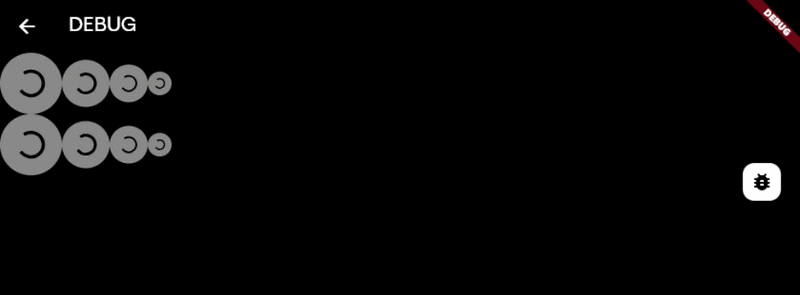

# ButtonWithLoadingIndicator

A Flutter widget — an animated button that smoothly transitions between a text state and a loading indicator.

---

## Demo




---

## Features

- 🔄 Smooth animated transition between text and loading states
- 📐 4 size presets: `extraSmall`, `small`, `normal`, `big`
- 🖼️ Optional trailing icon support
- 🎨 Pill-shaped design with subtle opacity change during loading
- ⚡ Built with `AnimatedSize` for fluid layout changes

---

## Installation

Copy `button_with_loading_indicator.dart` into your project and import it where needed:

```dart
import 'button_with_loading_indicator.dart';
```

---

## Usage

### Basic button

```dart
ButtonWithLoadingIndicator(
  title: 'Submit',
  status: ButtonWithLoadingIndicatorStatus.text,
  onPressed: () => print('Pressed!'),
)
```

### With loading state

```dart
ButtonWithLoadingIndicator(
  title: 'Submit',
  status: ButtonWithLoadingIndicatorStatus.loading,
  onPressed: () {},
)
```

### With icon

```dart
ButtonWithLoadingIndicator(
  title: 'Continue',
  status: ButtonWithLoadingIndicatorStatus.text,
  icon: Icon(Icons.arrow_forward),
  onPressed: () {},
)
```

### Toggle loading on tap

```dart
class MyWidget extends StatefulWidget {
  @override
  State<MyWidget> createState() => _MyWidgetState();
}

class _MyWidgetState extends State<MyWidget> {
  var _status = ButtonWithLoadingIndicatorStatus.text;

  void _handlePress() async {
    setState(() => _status = ButtonWithLoadingIndicatorStatus.loading);
    await Future.delayed(Duration(seconds: 2)); // your async work here
    setState(() => _status = ButtonWithLoadingIndicatorStatus.text);
  }

  @override
  Widget build(BuildContext context) {
    return ButtonWithLoadingIndicator(
      title: 'Save',
      status: _status,
      onPressed: _handlePress,
    );
  }
}
```

---

## Parameters

| Parameter | Type | Required | Default | Description |
|-----------|------|----------|---------|-------------|
| `title` | `String` | ✅ | — | Button label text |
| `status` | `ButtonWithLoadingIndicatorStatus` | ✅ | — | Controls whether button shows text or spinner |
| `onPressed` | `VoidCallback` | ✅ | — | Callback triggered on tap |
| `size` | `ButtonWithLoadingIndicatorSizes` | ❌ | `.normal` | Controls overall button size |
| `icon` | `Icon?` | ❌ | `null` | Optional icon shown after the title |

---

## Enums

### `ButtonWithLoadingIndicatorStatus`

| Value | Description |
|-------|-------------|
| `.text` | Shows the title (and optional icon) |
| `.loading` | Shows a `CircularProgressIndicator` |

### `ButtonWithLoadingIndicatorSizes`

| Value | Height | Font size |
|-------|--------|-----------|
| `.extraSmall` | 25px | 15sp |
| `.small` | 40px | 20sp |
| `.normal` | 50px | 24sp |
| `.big` | 65px | 30sp |

---

## License

BSD-3-Clause license